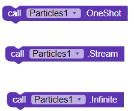

# Particles 

> Create particles animation in your app or game
>
> 
>
> `Permission : READ_EXTERNAL_STORAGE`
>
> `Price: $6 => 390RS`
>
> `size: 50.8kb`


Using this extension you can create amazing particles /confetti animation in your app. Below are some samples:

|  |  |  |
| :---------------------------------------------: | ------------------------------------------------------------ | ------------------------------------------------------------ |
|         Raining with draggable confetti         | Point animation                                              | Explosion animation                                          |


# Functions

```1.InitializePosition```

<!-- tabs:start -->


#### **Block image**


#### **Description**

For **point** particle emission use only x and y.


For particles to emit from a square eg: Raining in above gif, x,y,x1,y1 should be initialized


?> Note:1. InitializePostion first.<br> 2. Either x,y or both 4 variable should be initialized .

#### **Sample**

[sample](confetti?id=samples)

<!-- tabs:end -->

```2.InitializeConfetti```

<!-- tabs:start -->


#### **Block image**


#### **Description**

This blocks initialize the confetti

**layout:**` Any arrangement except scroll arrangements`

**colors**: `make a list of colors`

**images**:` make a list of images with path to image`


?> Note:1. InitializeConfetti second.<br> 2. At least colors list or images list should present  .

#### **Sample**

[sample](confetti?id=samples)

<!-- tabs:end -->


`3.Animation modes`

<!-- tabs:start -->


#### **Block image**


#### **Description**

This blocks animates particles by different methods as you see [here](confetti?id=particles)

**RainingMode:**` Creates a rainnig like animation`

**PointMode**: `Creates animation from a point`

**ExplosionMode**:` Create a explosion with a defined radius/bound`

Properties

| **RainingMode** | **PointMode** | ExplosionMode |
| --------------- | ------------- | ------------- |
| ExplosionMode   | ExplosionMode | ExplosionMode |

?> Note:1. After confetti initialized call any one of this function.<br>


#### **Related Properties**


For finding default values for  animation modes hover over it


#### **Sample**

[sample](confetti?id=samples)

<!-- tabs:end -->

```4.Emission Modes```

<!-- tabs:start -->


#### **Block image**



#### **Description**

This blocks helps to animate particles for specified duration

**OneShot:** ` Creates a one shot like animation`

**Stream**: `Creates animates for the provided duration`

**Infinte**: ` Create a infinite stream of particles.\n After setting any mode.`

Properties

| **RainingMode** | **PointMode** | ExplosionMode |
| --------------- | ------------- | ------------- |
| ExplosionMode   | ExplosionMode | ExplosionMode |

?> Note:1. After animation modes call any one emission mode function.<br>


#### **Related Properties**

 

#### **Sample**

[sample](confetti?id=samples)

<!-- tabs:end -->


`5.Terminate`


**Terminate**: `Terminates latest running animation`

# Properties

<!-- tabs:start -->

#### **Main Properties**


`ConfettiSize` :This defines size of particles.

`TimeToLeave`: Specifies a custom time to live (in `millisecond` )for the confetti generated . When a confetti reaches its time to live timer, it will disappear and terminate its animation.

`EmissionRate`:  The rate of emission particle per second
`EnableFadeout`: Enables or disables fade out animation to particles when leaving the screen.

`EnableTouch`: Enables or disables touch events for the confetti generated . By enabling touch, the user can touch individual particle and drag/fling them on the screen.

`


#### **Other**


For finding default values for  animation modes hover over it


#### **Sample**

[sample](confetti?id=samples)


<!-- tabs:end -->

# Samples

These re some example blocks

|  |  |  |
| ------------------- | ------------------- | ------------------- |
| Explosion           | Raining             | Point               |


# Buy Now


|                        Chec.io(`$6`)                         | Paypal(Contact [me](mailto:123jerinjacob007@gmail.com) after payment) - `$6` | [FREE](https://casagbic.com) | Paytm(Contact [me](mailto:123jerinjacob007@gmail.com) after payment) |
| :----------------------------------------------------------: | :----------------------------------------------------------: | ---------------------------- | :----------------------------------------------------------: |
| [](https://checkout.chec.io/particles) | [](https://www.paypal.com/cgi-bin/webscr?cmd=_s-xclick&hosted_button_id=TPPHBJDVJJA2Y) | [FREE](https://casagbic.com) | [](https://p-y.tm/ho-fKyi) |


-----